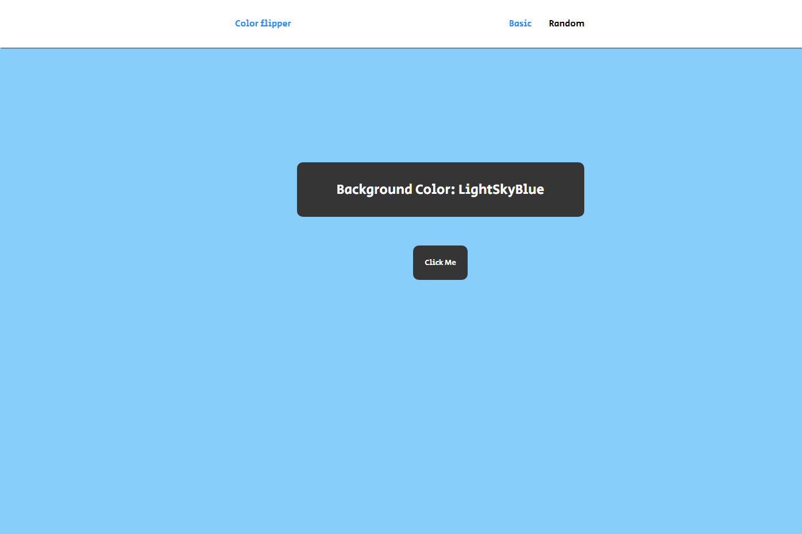

# Projeto Color Flipper

Projeto que usa como base este repositório do GitHub: https://github.com/john-smilga/javascript-basic-projects. Fiz alterações no CSS e também no modo de como são selecionadas as cores.

[Clique aqui para acessar](https://vitorbachini.github.io/colorflipper/)

## Tecnologias

- HTML
- CSS
- JavaScript

## Contato

vbachiniw@gmail.com